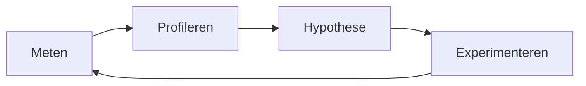

# C# Performance Labs

Je kent het moment wel: een op het oog volkomen redelijk stukje code slurpt in stilte een gigabyte RAM op, of duurt opeens meer dan 400ms, en je hebt nog geen idee waarom. C# Performance Labs bestaat om jou dat moment met opzet te laten meemaken, op een veilige plek: een profiler, een stopwatch, en niemand die je om 3 uur 's nachts belt.

Het is een zelfstudie-lab van kleine, met opzet kapotte programma's. Elk exercise geeft je een **symptoom**, geen diagnose ("deze export is traag", nooit "dit doet kwadratische string-concatenatie"), plus een ingebouwde load driver, een pass/fail-budget, oplopende hints en een uitgeschreven oplossing voor achteraf. Je zoekt het probleem zelf op met een echte profiler, welke dan ook, lost het op, en de harness vertelt je twee dingen: is het echt sneller geworden, en klopt de uitvoer nog. Geen krediet voor een snel fout antwoord.

**Nieuw in performance-werk?** Daar is Lab 0 precies voor bedoeld. **Al vertrouwd met .NET-internals en wil je gewoon de exercises?** Ook prima: spring direct naar Lab 1. Hoe dan ook, niemand beoordeelt je, en de enige deadline is degene die je zelf stelt.

## Snel starten

1. Installeer de [.NET 10 SDK](https://dotnet.microsoft.com/download/dotnet/10.0) (versie vastgezet in [`global.json`](global.json)).
2. Clone de repo en open `PerfLab.slnx` (laat `PerfLab.Solutions.slnx` voorlopig dicht, dat is de antwoordsleutel).
3. `dotnet run -c Release --project labs/L00-start-here/exercises/L00-01-activity-feed`, verwacht `FAIL`.
4. Lees het [uitgewerkte voorbeeld van Lab 0](docs/worked-example/README.md) om te zien hoe een afgeronde poging eruitziet, en werk daarna zelf de exercise uit.

Alles hieronder (methode, profiler-setup, hoe de harness een run beoordeelt) is naslagmateriaal voor zodra je op gang bent, geen verplichte kost voor stap 3.

## Methode



**Meten** komt altijd eerst: draai de exercise en verzamel een echt getal voordat je gaat gokken. **Profileren** om te zien waar dat getal daadwerkelijk vandaan komt, niet waar je aanneemt dat het vandaan komt. **Hypothese**: één specifieke, weerlegbare oorzaak, op schrift, voordat je code aanraakt. **Experimenteren** door precies één ding te veranderen. Daarna ben je weer bij **Meten**: draai het opnieuw, om te zien of het getal echt bewogen is en met hoeveel. Herhaal tot het slaagt.

## Status

Op dit moment gebouwd: **85 exercises** verdeeld over **Labs 0-14** (elk lab eindigt met een eindbaas-gevecht, behalve de baas-/capstone-labs zelf), plus **vijf Lab 8-exercises** (mysterieuze services diagnosticeren met alleen de CLI-tools). [ROADMAP.md](ROADMAP.md) heeft de volledige kaart, inclusief wat nog slechts geschetst is. Boeken, artikelen en documentatie per lab staan in [docs/READING-LIST.md](docs/READING-LIST.md).

**Begin met [Lab 0](docs/worked-example/README.md):** één exercise, al helemaal uitgewerkt (lab-log, hints, oplossing en post-mortem allemaal ingevuld), zodat je kunt zien hoe een afgeronde poging eruitziet voordat je zelf begint.

## Setup
- **.NET 10 SDK** (alles target `net10.0`; gebouwd en geverifieerd op .NET 10). De ASP.NET Core-labs (9-14) hebben bij de eerste build internet nodig om NuGet-packages op te halen (EF Core, enz.).
- **Een profiler.** Niets hier is aan één merk gebonden: elke exercise heeft alleen sampling-, tracing-, allocatie- en memory-snapshot-views nodig, die de meeste profilers in een of andere vorm bieden. Gebruik wat je al hebt:
  - **JetBrains Rider**, met de dotTrace- en dotMemory-plugins, waarmee de uitgeschreven oplossingen zijn gemeten, dus die terminologie komt het vaakst voor in de hints.
  - **Visual Studio** (Community-editie is genoeg): Debug → Performance Profiler geeft je CPU Usage, .NET Object Allocation en Memory Usage snapshots, wat hetzelfde terrein dekt.
  - **Losse dotTrace / dotMemory**, als je liever de hele IDE overslaat.
  - **De gratis CLI-tools** (`dotnet-trace`, `dotnet-counters`, `dotnet-gcdump`), cross-platform, geen IDE nodig. Lab 8 draait er volledig omheen, dus daar krijg je sowieso oefening mee. [docs/tools](docs/tools/README.md) heeft een korte gids per tool.
  - **PerfView** (Windows) of **`perf`** (Linux), als je dichter op het metaal wilt zitten.

  **Nieuw met de runtime?** [docs/RUNTIME.md](docs/RUNTIME.md) legt tiered JIT, OSR, Dynamic PGO en ReadyToRun uit, en waarom elke run wordt opgewarmd voordat hij wordt getimed. **Nieuw met profileren?** [docs/PROFILING-GUIDE.md](docs/PROFILING-GUIDE.md) begint met uit te leggen wat sampling, tracing, timeline, allocaties en snapshots elk daadwerkelijk *zijn*, niet alleen wanneer je ernaar grijpt, voordat het symptoom → modus → tool in kaart brengt, welke tool je ook kiest.
- Open `PerfLab.slnx`. **Laat `PerfLab.Solutions.slnx` dicht** totdat je een exercise hebt gehaald: het is de antwoordsleutel.

### Een exercise onder een profiler draaien, per tool
Wat je ook gebruikt, de vorm is hetzelfde: bouw **Release**, draai met `--profile --seconds 15`, en koppel een profiler in plaats van een debugger. Elke exercise en oplossing heeft al twee launch profiles in `Properties/launchSettings.json`: **Measure** (geen argumenten, de standaard, hetzelfde als gewoon `dotnet run`) en **Profile** (`--profile --seconds 15`). De IDE-stappen hieronder kiezen simpelweg **Profile**.

**Een launch profile stelt de argumenten in, niet de build-configuratie.** Gestart vanuit een IDE, of met gewoon `dotnet run`, bouwt een project **Debug** tenzij je zelf voor Release kiest, en dan drukt de harness `!! Debug build detected (JIT optimizer disabled). Numbers are meaningless` af. Zie je die regel, schakel dan over naar een Release-configuratie en draai opnieuw (op de machine van de auteur deed dezelfde snelle oplossing er 1.1 ms over in Debug en 0.7 ms in Release).

- **Rider:** elke exercise heeft een **Profile** launch profile (uit `Properties/launchSettings.json`, programma-argumenten `--profile --seconds 15`): selecteer die in de run-widget-dropdown, **zet de build-configuratie van de solution van Debug naar Release** (dat kan de launch profile niet voor je doen), gebruik daarna de profile-actie op die configuratie (Run-menu of het run-widget-menu, bewoording verschilt per versie) en kies een modus. Eerst sampling, tenzij een hint iets anders zegt.
- **Visual Studio:** stel de exercise in als startup project en kies de **Profile** launch profile in de Debug-dropdown (die heeft `--profile --seconds 15` al ingebouwd), **zet de solution-configuratie van Debug naar Release** (dat kan de launch profile niet voor je doen), en dan Debug → **Performance Profiler** → kies je tools → Start (niet F5: dat koppelt een debugger, en dat is precies wat je hier niet wilt).
- **CLI-tools:** `dotnet run -c Release --project <exercise> -- --profile --seconds 15 &` (of `dotnet run -c Release --project <exercise> --launch-profile Profile &` om de argumenten van het profile te gebruiken), pak het pid, en dan `dotnet-trace collect -p <pid>` of `dotnet-counters monitor -p <pid>`. Volledig spiekbriefje in [docs/PROFILING-GUIDE.md](docs/PROFILING-GUIDE.md).

## Hoe je een exercise aanpakt
1. Lees de `README.md` van de exercise (symptoom + budgets). Als je jezelf kunt bedwingen, open `Workload.cs` nog niet.
2. Draai hem in **Release**: `dotnet run -c Release --project exercises/<name>` → verwacht `FAIL`. Dat is precies de bedoeling.
3. Profileer hem (zie [docs/PROFILING-GUIDE.md](docs/PROFILING-GUIDE.md) voor tool-opties). Gebruik de **Profile** launch profile (of `--profile` op de CLI) zodat hij lang genoeg draait voor een echte sample.
4. Schrijf in [LAB-LOG.md](templates/LAB-LOG.md) **wat je zag en je hypothese**, *voordat* je code verandert. Ja, echt. Dit is de stap die iedereen wil overslaan, en degene die daadwerkelijk intuïtie opbouwt.
5. Verander **één ding**. Draai opnieuw. Herhaal tot `RESULT: PASS`.
6. Vastgelopen na 15+ minuten? Open één hint uit `HINTS.md`. Eén maar. Nodig je er dan nog een, de volgende.
7. Lees na het slagen `solutions/<name>/SOLUTION.md`, vergelijk met je eigen fix, en probeer daarna de "Extra credit"- en "Go further"-vragen.

## De harness
Sommige termen hieronder (gen2, p99, kept-after-GC) zeggen je misschien nog niet veel als je hier helemaal nieuw in bent. Dat is prima. Lab 0 en de leeslijst behandelen ze grondig; je maakt met elk ervan pas echt kennis zodra een exercise er daadwerkelijk op afrekent. Behandel deze sectie als naslagwerk om op terug te komen, niet als iets om vooraf uit je hoofd te leren.
```
dotnet run -c Release --project labs/L01-hot-spots/exercises/L01-01-invoice-export              # warm up, 5 measured runs, PASS/FAIL
dotnet run -c Release --project labs/L01-hot-spots/exercises/L01-01-invoice-export -- --profile # loop ~15s (--seconds N) for profilers
```

- **Exitcode:** `0` geslaagd · `1` over budget · `2` fout resultaat (checksum-mismatch: een snel fout antwoord telt niet).
- **Tijdsbudgetten zijn geschaald naar jouw machine.** Ze zijn geschreven in "referentie-ms": het budget van elke exercise is
  afgestemd op de machine waarop deze cursus is gebouwd. Voor elke gemeten run draait `Lab.MachineFactor()` (in
  [`src/PerfLab.Harness/Lab.cs`](src/PerfLab.Harness/Lab.cs)) een vaste, allocatievrije CPU-lus (40.000.000
  xorshift-iteraties, `AggressiveOptimization` zodat tiered JIT het niet verstoort) vier keer en houdt de
  snelste aan. Die beste tijd, gedeeld door `ReferenceSpinMs` (50 ms, de gemeten spin-tijd van die referentiemachine
  zelf), is de machinefactor: `factor = bestSpinMs / 50.0`. Elk
  `MaxMedianMs`-, `MaxP99Ms`-, `MaxCpuMs`- en `MaxFirstRunMs`-budget wordt met die factor vermenigvuldigd voordat het vergeleken wordt; **allocatie-,
  retained-memory- en gen2-budgetten worden nooit geschaald**, omdat bytes niet afhankelijk zijn van CPU-snelheid zoals kloktijd dat wel is. Zet `PERFLAB_NO_SCALE=1` om `factor = 1.0` te forceren en te vergelijken met de ruwe referentiegetallen.
  De factor meet alleen ruwe CPU-doorvoer, dus corrigeert hij te weinig voor exercises waarvan de tijd gedomineerd wordt door een vaste
  `Task.Delay`/`Thread.Sleep` (het merendeel van de gesimuleerde downstream-calls in Lab 9+): die worden niet sneller op een
  snellere CPU, dus een machine die op de spin-lus veel sneller is dan de referentie kan het budget verkleinen tot onder
  wat alleen de vaste delays al kosten, waardoor een correcte oplossing faalt. Faalt een *oplossing* alleen op tijd/p99 terwijl
  al het andere slaagt, verdenk dan eerst dit voordat je de fix verdenkt.
  Draai `-- --calibrate` op een willekeurige exercise om de eigen vastgezette spin-lus-tijd van deze machine af te drukken, mocht je ooit
  `ReferenceSpinMs` opnieuw moeten afleiden voor een nieuwe referentiemachine (vergeet niet daarna het budget van elke exercise met dezelfde ratio te herschalen, niet alleen de constante).
- Hij waarschuwt luid bij Debug-builds en wanneer een debugger is gekoppeld, allebei maken de timings zinloos, en hij nagt liever dan je een nep-pass te laten vieren.
- Concurrent GC staat uit en workstation GC staat aan (in `Directory.Build.props`) om ruis te verminderen. Latere labs zetten dit met opzet om: dat is dan de exercise.
- **Warm-up is tijdsgebaseerd** (minstens 1 s) zodat een correcte fix niet gemeten wordt terwijl de JIT nog trage tier-0-code draait. De **eerste** warm-up-run wordt toch getimed en afgedrukt als `First run: … ms`: is die veel trager dan de gemeten runs, dan gaat er iets alleen bij een koude start mis, en verbergt warm-up dat.
- Lab 2-exercises kunnen ook afrekenen op **gen2-collecties per run** (`MaxGen2Collections`), voor problemen waarbij bytes alleen niet het hele verhaal vertellen.
- Lab 2+-inputs worden één keer gegenereerd, bij eerste gebruik, zodat de warm-up van de harness ze opvangt en het allocatiebudget alleen het algoritme meet.
- Latere labs voegen optionele budgetten toe: **kept-after-full-GC** (lekken), **p99-latency** en **CPU-tijd** (concurrency), een **first-run**-budget (opstartgedrag), en **named metrics** die de workload rapporteert (`sqlCommands`, `connections`, `peakInflight`, …). `--cold` drukt elke run af zonder warm-up (Lab 6-07).
- `Workload.Reset()` (waar aanwezig) ruimt *testopstelling* op tussen runs, bijv. een statische event hub. Het maakt nooit deel uit van de fix: als jouw fix in `Reset()` zit, heb je de test gefixt, niet de code.
